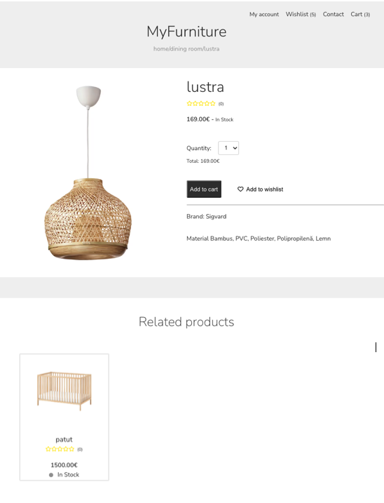

## MyFurniture

A virtual store where customers can browse the catalog and select products of interest. The selected items may be collected in a shopping cart. At checkout time, the items in the shopping cart will be presented as an order. At that time, more information will be needed to complete the transaction.

### Thechnologies:

React.js, Redux
Python, Django, Django Rest Framework, PostgreSQL

### Examples from the project

